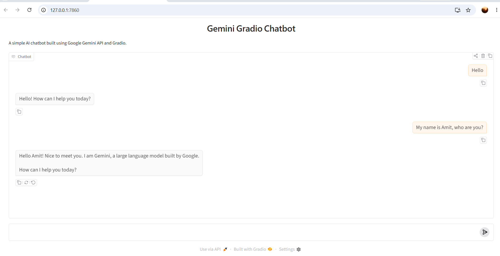

# 🤖 Gemini + Gradio Chatbot

A simple AI chatbot built using **Python**, **Google Gemini API**, and **Gradio**. This project demonstrates how to integrate Google's **Gemini Large Language Model (LLM)** with a user-friendly web interface.

---

# 📖 Project Overview

This project demonstrates how to build an AI-powered chatbot by integrating the **Google Gemini API** with **Gradio**.

The chatbot accepts user input through a web interface, sends the prompt to the Gemini model, and displays the AI-generated response in real time.

This project is part of my **Agentic AI Learning Journey**, where I am exploring how Large Language Models (LLMs) can be integrated into Python applications.

---

# 🚀 Features

- 🤖 Google Gemini API Integration
- 💬 Interactive chatbot using Gradio
- 🔐 Secure API key management using `.env`
- 📋 Displays available Gemini models
- 💡 Maintains conversation context using `start_chat()`
- 🐍 Simple and beginner-friendly Python code

---

# 🛠️ Technologies Used

- Python 3.x
- Google Gemini API
- Gradio
- python-dotenv

---

# 📂 Project Structure

```text
Gemini_Gradio_Chatbot/
│
├── gemini_gradio_chatbot.py
├── requirements.txt
├── .env.example
├── .gitignore
├── README.md
└── chatbot-demo.png
```

---

# ⚙️ Installation

## Step 1: Clone the Repository

```bash
git clone https://github.com/amitkoundal02/agentic-ai-devops.git
```

---

## Step 2: Navigate to the Project Folder

```bash
cd agentic-ai-devops/AgenticAI-Learning/Gemini_Gradio_Chatbot
```

---

## Step 3: Install Required Packages

```bash
pip install -r requirements.txt
```

---

## Step 4: Configure the Gemini API Key

Create a `.env` file inside the project directory.

Add your Gemini API Key:

```text
GOOGLE_API_KEY=YOUR_GOOGLE_API_KEY
```

> **Note:** Never upload your actual `.env` file to GitHub. The repository includes a `.env.example` file as a reference.

---

## Step 5: Run the Application

```bash
python gemini_gradio_chatbot.py
```

Gradio will launch a local web server.

Open the URL displayed in the terminal (typically **http://127.0.0.1:7860**) in your web browser.

---

# 📷 Application Screenshot

Below is the Gemini Gradio Chatbot running locally. The chatbot accepts user input through a Gradio web interface, sends the prompt to the Google Gemini API, and displays the AI-generated response in real time.



---

# 🔄 Application Workflow

```text
            User
              │
              ▼
     Gradio Chat Interface
              │
              ▼
        Python Function
              │
              ▼
      Google Gemini API
              │
              ▼
    AI Generated Response
              │
              ▼
     Gradio Chat Interface
```

---

# 📦 Required Packages

Install all required packages using:

```bash
pip install -r requirements.txt
```

**requirements.txt**

```text
google-generativeai
gradio
python-dotenv
```

---

# 🎯 Learning Outcomes

Through this project, I learned:

- How to integrate the Google Gemini API with Python
- How to securely manage API keys using environment variables
- How to list available Gemini models
- How to create and maintain a chat session using `start_chat()`
- How to build an interactive chatbot using Gradio
- How Python communicates with Large Language Models (LLMs)
- The end-to-end workflow from **User Prompt → Gemini API → AI Response**

---

# ▶️ Example

**User**

```text
Hello
```

**Gemini Response**

```text
Hello! How can I help you today?
```

**User**

```text
My name is Amit, who are you?
```

**Gemini Response**

```text
Hello Amit! Nice to meet you. I am Gemini, a large language model built by Google. How can I help you today?
```

---

# 👨‍💻 Author

## Amit Koundal

**DevOps | Cloud | AI | Agentic AI Learner**

### GitHub Profile

https://github.com/amitkoundal02

### Repository

https://github.com/amitkoundal02/agentic-ai-devops

### LinkedIn

https://www.linkedin.com/in/amit-koundal-5833ba33a

---

# ⭐ Support

If you found this project useful, please consider giving it a ⭐ on GitHub.

Feedback, suggestions, and contributions are always welcome.